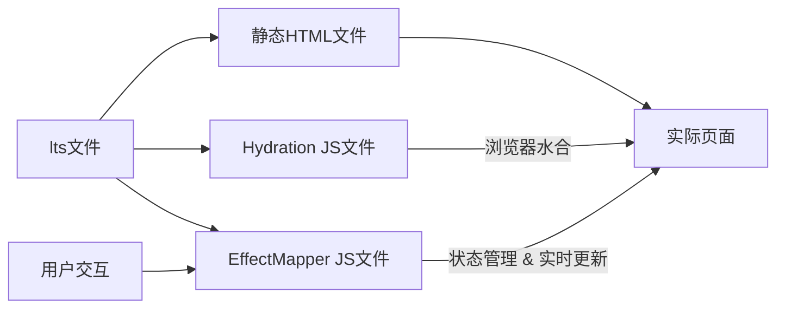
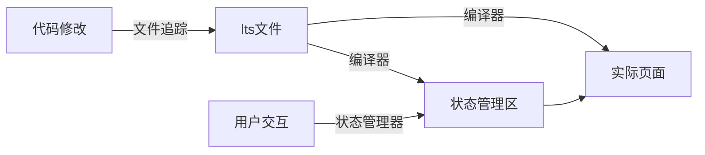
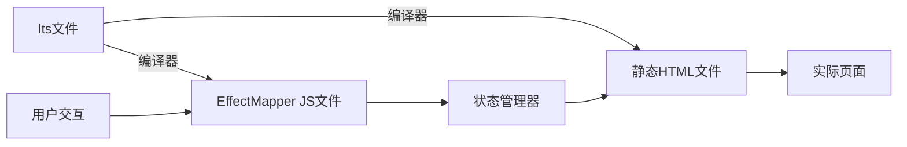

# 响应式系统

## 响应式变量

`Preezid` 响应式变量是 `Preezid` 响应式系统的基础, 它分为 `status()` 和 `store()` 两种类型.

```lts
define {
  const count = status(0)
}

load {
  button.@click(() => count.value++) { "Count: " + count.value }
}
```

`EffectMapper` 将侦测 `count.value` 的变化, 并在其变化时重新渲染包含它的组件.

## 动态节点

渲染机制 章节中, 提到了 `PiteRender` 会标记的四类动态节点:

1. 内容或属性直接依赖响应式变量的节点 `DynamicSelf`
2. 处于动态上下文的节点 `DynamicScope`
3. 含有动态子节点的直接父节点 `DynamicParent`
4. 同级含有动态节点的节点 `DynamicSibling`

它们的更新机制如下:

### DynamicSelf

`DynamicSelf` 节点是最简单的动态节点, 它们的内容或属性直接依赖响应式变量, 因此在响应式变量变化时, 只需重新计算该节点的内容或属性即可.

例如:

```ts
info.update(() => {
  document.querySelector(`[data-id-${key}]`).style.color = info.value.color
  document.querySelector(`[data-id-${key}]`).textContent = info.value.name
})
```

### DynamicScope

`DynamicScope` 节点处于动态上下文中, 因此它们可能因为响应性变量而创建和删除.

例如:

```ts
arr.update(() => {
  document.querySelector(`[data-id-${key}]`).remove()
  document.querySelector(`[data-id-${key}]`).insertAdjacentElement(
    render("span").slot(item.name).build()
  )
})
```

### DynamicParent

`DynamicParent` 节点含有动态子节点, 因此它们可能需要承载子节点的创建和删除.

例如:

```ts
arr.update(() => {
  document.querySelector(`[data-id-${key}]`).innerHTML = ""
  arr.value.forEach(item => {
    document
      .querySelector(`[data-id-${key}]`)
      .appendChild(render("span").slot(item.name).build())
  })
})
```

### DynamicSibling

`DynamicSibling` 节点的同级含有动态节点, 因此它们可能需要承载同级节点的创建和删除.

例如:

```ts
arr.update(() => {
  document.querySelector(`[data-id-${key}]`).insertAdjacentElement(
    render("span").slot(item.name).build()
  )
})
```

动态节点类型可以混合使用, 因此生成的更新代码也会相应地混合使用多种更新方式.

## `diff` 算法

虽然 `Preezid` 尽可能的保证精确和最小化的更新, 但依旧可能出现不必要更新的情况, 例如:

```lts
define {
  const count = status(0)
  const isCountLessThenFive = status(() => count.value < 5)
  
  const increase = () => count.value++
}
```

当调用 `increase` 函数时, `count` 会增加, 但 `isCountLessThenFive` 可能并不会变化, 但由于它依赖了 `count`, 因此它依然会被标记为需要更新.

如果 `isCountLessThenFive` 影响了某些动态节点, 那么这些节点也会被更新, 尽管它们的实际内容并没有变化.

所以 `EffectMapper` 会在实际更新之前, 检测一次响应式变量是否真的被更新, 是否真的需要处理副作用.

对于简单变量, 它会在 `.update()` 中进行比对.

对于复杂对象, 则会处理成若干 `k - v` 对并逐个绑定副作用关系, 并在每个 `k - v` 中进行比对, 触发更新.

## 运行模式

### `build` 模式

`build` 模式下, `Preezid` 会生成静态的 `HTML` 文件以及运行时的 `js` 文件.

`Preezid` 将构建两类运行时 `js` 文件, 分别是 `Hydration` 文件和 `EffectMapper` 文件.

`Hydration` 文件负责在页面加载时, 将静态的 `HTML` 文件转换为动态的页面, 它会扫描页面中的响应式变量标记, 并将它们与运行时的响应式变量进行绑定.

`EffectMapper` 文件负责在响应式变量变化时, 触发相应的更新操作, 它会根据响应式变量与动态节点的映射关系, 重新渲染需要更新的节点.



### `dev` 模式

由于 `dev` 模式下, 需要频繁地进行代码修改和调试, 因此 `Preezid` 会在 `dev` 模式下启用运行时编译工具 `Preezid Dev`.

开发模式中响应式变量将在 `Preezid` 的 `Status Manager` 模块统一存储/管理, `EffectMapper` 功能也会继承在 `Status Manager` 中.



### `Preezid SSR` 模式

`Preezid` 提供了直接在 `Preezid` 服务器运行的 `SSR` 模式, 该模式与 `dev` 模式类似, 但状态管理依旧在浏览器完成, 且不再追踪文件变化.


