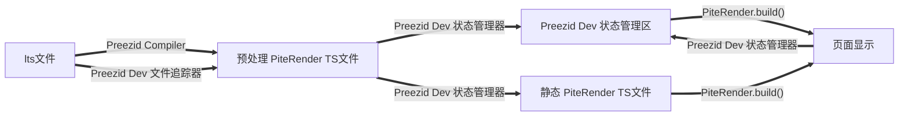
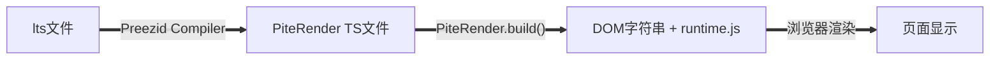
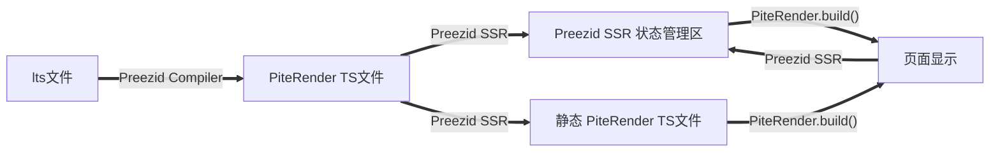

# 响应式系统

`Preezid` 的响应式思路来源于 `svelte`, 在 `PiteRender` 阶段分析响应式依赖, 并在 `runtime.js` 中生成更新代码.

## 响应式变量

`Preezid` 的响应式变量与 `react` 和 `vue` 相同, 使用 `status()`, `store()` 等构建.

`Preezid Compiler` 会在响应式变量发生修改的代码之后, 立即调用对应变量的 `.update()`.

`PiteRender` 会在 `.build()` 阶段将所有有关响应式变量依赖部分的更新代码写入到对应响应式变量的 `.update()` 方法中.

```lts
define {
  const count = status(0)
}

load {
  button.@click(() => count.value++) { "Count is: " + count.value }
}
```

`Preezid Compiler` 编译的 `PiteRender TS` 代码如下:

```ts
render("button")
  .event("onclick", () => {
    count.value++
    count.update() // 追加的 .update() 调用
  })
  .slot("Count is: " + count.value)
  .build()
```

`PiteRender` 将生成带标记的 DOM 和 `runtime.js` 代码如下:

```html
<button data-id-{hash-id}>Count is: <button>
```

```js
count.update = () => {
  const button = document.querySelector("[data-id-{hash-id}]")
  button.innerText = "Count is: " + count.value
}
```

## `diff` 算法

虽然 `Preezid` 没有虚拟节点, 但通过比对 `diff` 来选择性的渲染 DOM, 仍然是提升性能的有效手段.

例如如下嵌套的 `status()` 变量:

```lts
define {
  const n = status(0)
  const isNLessThan5 = status(() => n < 5)
  
  const increment = () => {
    n.value++
  }
}

load {
  // 基于 isLessThan5 的大量渲染
}
```

生成的 `runtime.js` 如下:

```js
const increment = () => {
  n.value++
  n.update() // 追加的 .update() 调用
}

n.update = () => {
  isNLessThan5.update() // 追加另一个 .update() 调用
}

isLessThan5.update = () => {
  // 基于 isLessThan5 的大量渲染
}
```

显然, 前几次 `increment()` 的调用完全不需要触发如此多的重新渲染, 因此 `diff` 算法还是必要的.

`PiteRender` 中, 会给每一个响应式变量生成一个 `.prev` 属性, 用于存储上一次的值, 并在 `.update()` 中进行比对:

```js
const increment = () => {
  n.value++
  n.update() // 追加的 .update() 调用
}

n.update = () => {
  if (n.prev === n) return
  n.prev = n.value

  isNLessThan5.update() // 追加另一个 .update() 调用
}

isLessThan5.update = () => {
  if (isNLessThan5.prev === isNLessThan5.value) return
  isNLessThan5.prev = isNLessThan5.value
  
  // 基于 isLessThan5 的大量渲染
}
```

## `dev` 模式运行状态

`dev` 模式下, `Preezid Dev` 会监视文件变化, 并在文件变化时重新编译对应文件, 同时 `PiteRender` 也会重新生成.

但为了保证更新时状态不丢失, `dev` 模式将完全采用 `SSR` 的方式进行渲染, `dev` 服务器将在独立的区域存储所有状态, 且行为在 `PiteRender` 之前, 由 `Preezid Dev` 完成.

传入 `PiteRender` 的数据将是完全静态的数据, `PiteRender` 只负责生成 DOM 和事件绑定, 不再处理任何状态相关的逻辑.

同时, `PiteRender` 将直接在浏览器运行, 而非 `.build()` 成 DOM 和 `runtime.js` 后再渲染.



## `build` 模式运行状态

`build` 模式构建过程与 `svelte` 类似, 将构建尽可能多的 `DOM` 字符串和管理所有交互逻辑的一系列 `runtime.js`.



`DOM字符串 + runtime.js` 即为最终编译产物, 将保存在 `/.dist` 目录中, 之后可直接部署到静态服务器中运行.

## `build SSR` 模式运行状态

由于 `PiteRender` 本身即可直接运行, 因此 `Preezid` 提供了 `build SSR` 运行模式, 即在服务器中运行 `Preezid SSR`, 生成完整的 `HTML` 页面, 并将页面发送到浏览器中.



与 `dev` 模式相同, 只不过 `Preezid SSR` 不会再监视文件变化.
